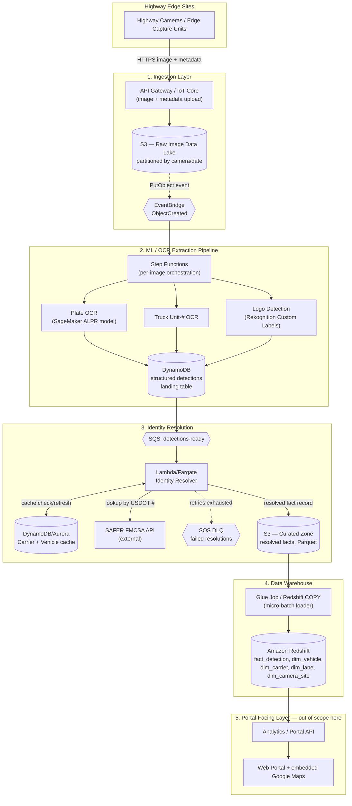
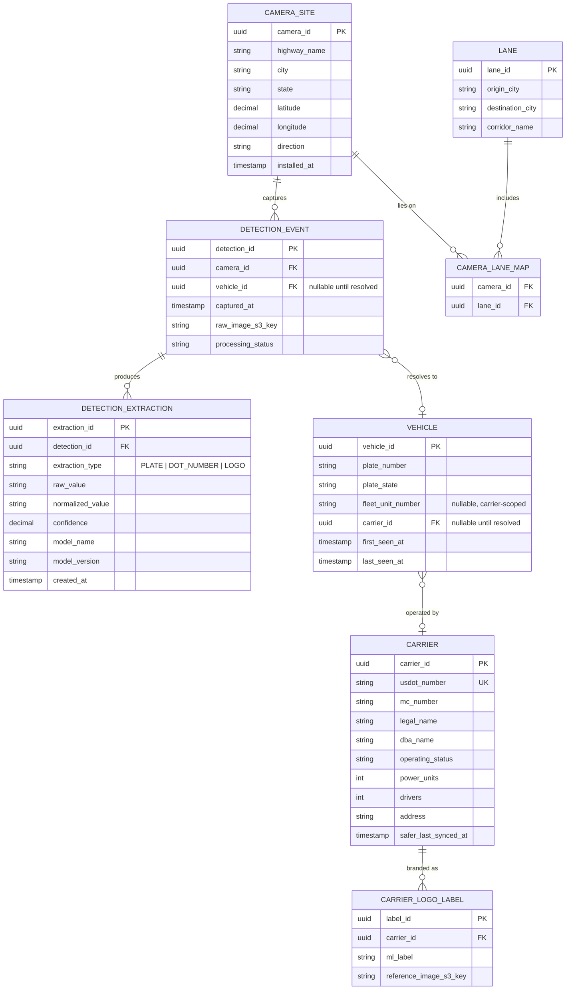

# Genlogs Platform Architecture — Component Design & Database Design

Addresses `requirements.md` points **2** (architecture/component/data-flow) and **3** (database design)
for the full Genlogs platform (nationwide highway-camera truck tracking, cross-referenced against
SAFER FMCSA). This is a logical/component architecture, not a deployment plan — hosting tiers, IaC and
CI/CD are the `delivery-manager` agent's job once this design is agreed.

**Out of scope here:** the portal simulation API from point 4 (origin/destination → static carrier list)
is a separate, already-scoped OpenSpec change and is not redesigned in this document.

## 1. Component & Data-Flow Architecture (Point 2)

The platform is a five-stage pipeline: camera ingestion → ML/OCR extraction → identity resolution
against SAFER → a data warehouse → a portal-facing read layer. Each stage is decoupled from its
neighbors by a queue or event bus so that a slowdown or outage in one stage (most notably the external
SAFER API) does not back up or drop data in the stage before it.

### Stage 1 — Ingestion Layer
- **Highway cameras / edge capture units** trigger on vehicle presence and emit a high-resolution
  still image plus capture metadata (camera ID, GPS/mile-marker, timestamp, direction of travel).
- **API Gateway (or AWS IoT Core** if cameras are managed as a device fleet with persistent
  connections) is the ingress point, authenticating each camera site and accepting the image upload.
- Images land immediately and immutably in **Amazon S3** (raw data lake), partitioned by
  `camera_id/yyyy/mm/dd/hh` for efficient downstream batch access and lifecycle management
  (e.g., transition to Glacier after N days — raw frames are only needed transiently once extraction
  succeeds).
- The S3 `PutObject` event is published to **EventBridge**, decoupling "an image arrived" from
  "an image needs processing" — nothing downstream polls S3.

### Stage 2 — ML/OCR Extraction Pipeline
- EventBridge triggers a **Step Functions** state machine per image. Step Functions is preferred over
  a bare Lambda-per-event because extraction has multiple independent sub-tasks with different failure
  modes that need their own retry/backoff policy and observability:
  1. **Plate OCR** — a specialized ALPR model (SageMaker real-time endpoint; generic Rekognition text
     detection is not reliable for plates).
  2. **Truck/fleet unit-number OCR** — the carrier-assigned unit number painted on the cab (not a
     national ID — see the modeling note under Point 3).
  3. **Company logo detection** — Rekognition Custom Labels model trained on carrier logos.
  A cheap upstream vehicle/truck-presence filter (Rekognition Labels) can short-circuit non-truck
  frames before the three heavier branches run.
- Each branch's output (raw text/label + confidence + model version) is written as a normalized row to
  a **structured detections landing store**. This is intentionally **DynamoDB**, not the relational
  warehouse: extraction output is high-volume, per-field, semi-structured (a given image may yield 0–3
  extraction rows), and doesn't need joins yet — a fast key-value append fits better than forcing every
  write through a relational schema at ingest time. The relational modeling (point 3) happens one stage
  later, once records are curated.

### Stage 3 — Identity Resolution
- New rows in the detections store publish to an **SQS queue** (`detections-ready`), consumed by a
  small pool of **Lambda/Fargate workers**. SQS (rather than a direct call from the extraction Lambda)
  exists specifically to protect the next hop: the **SAFER FMCSA API** is an external dependency with
  its own rate limits and no SLA Genlogs controls, so the queue lets Genlogs throttle outbound calls
  independently of inbound image volume, retry with backoff, and dead-letter (DLQ) permanently failing
  lookups instead of blocking the pipeline.
- A **carrier/vehicle cache** (DynamoDB or Aurora, keyed by USDOT number) is checked before calling
  SAFER: a carrier's SAFER record doesn't change per truck sighting, so re-resolving the same USDOT
  number on every detection would be wasteful and would burn through SAFER's rate limit for no benefit.
  Cache entries are refreshed on a TTL (e.g., 30 days), not per-detection.
- On a cache miss, the worker calls SAFER by the detected USDOT number, merges the result with the
  detection (plate, logo, unit number) into a resolved fact record, and writes it as Parquet/JSON to an
  **S3 curated zone**, partitioned by date — this is the handoff point into the warehouse.

### Stage 4 — Data Warehouse
- A **Glue job (or scheduled Redshift `COPY`)** loads new curated files into **Amazon Redshift** on a
  short micro-batch schedule (minutes, not seconds). This is deliberate: Redshift is optimized for bulk
  loads and analytical scans, not row-by-row transactional upserts, so batching the load rather than
  having the identity-resolution worker write directly keeps the warehouse workload in its sweet spot.
  Snowflake is an equally valid substitute if the team prefers it or is already multi-cloud.
- The warehouse holds the relational schema described in Point 3 below and is the **only** thing the
  portal-facing analytics layer queries — it never reads S3 or DynamoDB directly.

### Stage 5 — Portal-Facing Layer (out of scope for this document)
- An analytics/portal API reads from Redshift (optionally behind a cache/materialized view for the
  "top carriers on lane X→Y" query) and serves the web portal. This box is shown only to complete the
  data flow; its endpoints and the static-data version of it are covered by the separate, already-scoped
  point-4 exercise.

### Diagram



### Key trade-offs and risks

| Decision | Trade-off |
|---|---|
| DynamoDB landing table between extraction and resolution, relational warehouse after | Avoids forcing high-volume, variable-shape ML output through a rigid schema at ingest time, at the cost of maintaining two stores instead of one. |
| SQS between extraction and SAFER lookups | Adds latency (seconds–minutes) but isolates the pipeline from SAFER's rate limits/outages — without it, a SAFER slowdown would back-pressure all the way to image ingestion. |
| USDOT cache with TTL instead of resolving on every detection | Cuts SAFER call volume by orders of magnitude; risk is serving a stale carrier status for up to the TTL window (acceptable — SAFER operating-status changes are infrequent relative to sighting frequency). |
| Micro-batch load into Redshift instead of direct writes | Matches Redshift's strength (bulk analytical loads) but means the portal's data is minutes, not seconds, behind — acceptable since the portal use case is historical lane volume, not live tracking. |
| Single external dependency on SAFER FMCSA API | This is the platform's clearest single point of failure/degradation for the "identity" side of the pipeline; the cache plus DLQ-and-retry are the mitigations. Detections still land and can be re-resolved later even if SAFER is down. |
| Raw plate images are PII | Encrypt the S3 raw bucket at rest, restrict access by IAM role, and apply a retention/lifecycle policy so raw frames don't persist indefinitely once extraction has succeeded — call this out to whoever owns compliance before going live. |

## 2. Database & Warehouse Design (Point 3)

### Modeling decisions

- **USDOT numbers identify carriers (companies), not individual vehicles.** SAFER resolves a USDOT
  number to a `CARRIER` record. An individual truck is identified by its license plate (+ state), with
  the carrier-painted fleet unit number as a secondary, carrier-scoped (not globally unique) identifier.
  `VEHICLE` and `CARRIER` are therefore modeled as separate entities, linked once resolution succeeds.
- **A detection can produce zero to several extractions** (plate, DOT number, logo may not all be
  legible in a given frame), so extractions are a separate child table (`DETECTION_EXTRACTION`) rather
  than nullable columns bolted onto `DETECTION_EVENT` — this also captures per-extraction confidence and
  model version, which matters for auditing/retraining.
- **Lane volume needs a "lane" concept that cameras don't inherently have.** Cameras sit at fixed
  highway locations; "NYC → Washington DC" is a corridor, not a single camera. The simplest model that
  supports the point-4 query is a static `LANE` dimension (origin city, destination city, named
  corridor) with a many-to-many `CAMERA_LANE_MAP` join, tagging which camera sites lie on which named
  corridors. This is a deliberate simplification: it matches the exercise's fixed city pairs and is far
  cheaper than dynamically inferring a lane by reverse-geocoding pairs of consecutive sightings of the
  same vehicle — that approach would be more general (handles arbitrary city pairs precisely) but is not
  needed for the stated use case and adds real complexity (trip-stitching, geocoding cost/latency).
- This schema is what the warehouse (Redshift/Snowflake) holds. The upstream S3/DynamoDB landing zones
  are intentionally not modeled here — they're semi-structured staging, not the queryable layer.

### Diagram



### Supporting the lane-volume query

The point-4 use case ("which carriers move the highest volume of trucks between city A and city B")
resolves to:

```sql
SELECT c.legal_name, COUNT(DISTINCT v.vehicle_id) AS trucks
FROM detection_event de
JOIN camera_lane_map clm ON clm.camera_id = de.camera_id
JOIN lane l             ON l.lane_id = clm.lane_id
JOIN vehicle v          ON v.vehicle_id = de.vehicle_id
JOIN carrier c          ON c.carrier_id = v.carrier_id
WHERE l.origin_city = :origin AND l.destination_city = :destination
  AND de.captured_at >= :window_start
GROUP BY c.legal_name
ORDER BY trucks DESC
LIMIT 10;
```

Indexes to support this at warehouse scale: `(camera_id)` on `camera_lane_map` (already small/static),
`(lane_id, captured_at)` via the join path, and a Redshift sort/dist key on `detection_event.captured_at`
with `camera_id` as a compound sort key, since every analytics query filters by lane (via camera) and
time window.

## Hand-off summary

This document covers points 2 and 3 only. Concrete next steps once this design is accepted:

- **backend-developer**: no work yet from this document — the point-4 portal API is a separate, already
  static-data-only exercise and does not need the pipeline above implemented.
- **delivery-manager**: once/if the full pipeline is ever built (beyond the point-4 simulation), this
  document is the input for choosing a deployment tier (Starter/Growth/Scale) and writing the IaC for
  the AWS services named above (S3, EventBridge, Step Functions, Lambda, SageMaker/Rekognition,
  DynamoDB, SQS, Glue, Redshift).
- No changes to `data/carriers.mock.json` or the point-4 scope are implied by this document.
